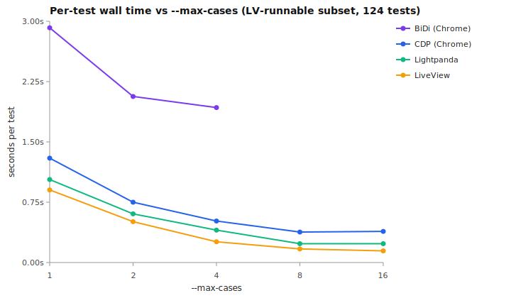

# Wallabidi

[](https://github.com/u2i/wallabidi/blob/main/LICENSE)

Concurrent browser testing for Elixir. Write your tests once — they run on the fastest driver that supports them.

What that means in practice:

- **Real multi-threading with Chrome via CDP** (and aspirationally BiDi) — no chromedriver in the loop. CDP performs better today; BiDi is the future-proof path and tracks the W3C protocol's evolution.
- **Multi-threading with Lightpanda** — a headless JS-capable browser that's fast enough to run nearly as quickly as the LiveView driver. Lightpanda is a practical default for full functional test suites.
- **LiveView driver** for tests that don't need a browser at all — renders pages in-process via `Phoenix.ConnTest`.

Wallabidi is a fork of [Wallaby](https://github.com/elixir-wallaby/wallaby) with these four drivers, automatic LiveView-aware waiting, and a public API close to Wallaby's for easy migration.

## Drivers

| Driver | Speed | What it does | When to use |
|--------|-------|-------------|-------------|
| **LiveView** | ~0ms/test | Renders pages in-process via Phoenix.ConnTest. No browser. | Default for local dev — instant feedback |
| **Lightpanda** | ~50ms/test | Headless JS-capable browser via CDP. No CSS rendering. | Fast path for full functional suites — nearly LiveView speed |
| **Chrome (CDP)** | ~200ms/test | Full browser via Chrome DevTools Protocol. Real multi-threading via Chrome's per-target threads. | Full fidelity (CSS, screenshots, mouse). Best concurrent throughput today. |
| **Chrome (BiDi)** | ~600ms/test | Full browser via WebDriver BiDi (chromium-bidi → Chrome). Cross-engine portable. | Future-proof choice as BiDi matures; aspirationally replaces CDP. |

Tests declare their minimum requirement with tags:

```elixir
# Runs on LiveView driver (fastest)
feature "create todo", %{session: session} do
  session |> visit("/todos") |> fill_in(text_field("Title"), with: "Buy milk") |> ...
end

# Needs a headless browser (JS execution, cookies)
@tag :headless
feature "stores preference in cookie", %{session: session} do
  session |> visit("/settings") |> execute_script("document.cookie = 'theme=dark'", [])
end

# Needs a full browser (screenshots, CSS visibility, mouse events)
@tag :browser
feature "uploads a file", %{session: session} do
  session |> visit("/upload") |> attach_file(file_field("Photo"), path: "test/fixtures/photo.jpg")
end
```

Each test runs on the **cheapest driver** that supports it. No env vars, no aliases — just `mix test`.

## Concurrency and performance

Each driver scales differently with `--max-cases`. The values below come from running the [perf_bench](https://github.com/u2i/perf_bench) LV scenario suite on a 16-thread Mac laptop (M-series). perf_bench is a separate harness containing 136 LiveView-focused scenarios — happy paths only, no waiting-for-absence tests — so it's a better fit for cross-driver measurements than the wallabidi integration suite, which contains plenty of error-case waits.



Wall time in seconds for the [perf_bench](https://github.com/u2i/perf_bench) LiveView scenario suite (136 tests) at each `--max-cases`:

| Driver         | mc1    | mc2   | mc4   | mc8     | mc16        |
|----------------|--------|-------|-------|---------|-------------|
| **LiveView**       | 15s    | 9s    | 6s    | **4s**  | 4s          |
| **Lightpanda**     | 43s    | 22s   | 12s   | **8s**  | 8s          |
| **CDP** (Chrome)   | 68s    | 52s   | **48s** | 51s   | 52s         |
| **BiDi** (Chrome)  | 486s   | 100s  | 71s   | **68s** | 259s ⚠ (2 flakes) |
| **Wallaby** (chromedriver) | 218s | 122s | 80s | 69s ⚠ (4 flakes) | 70s ⚠ (5 flakes) |

⚠ flag = flaky failures at this concurrency. Chrome BiDi's mc=16 trips chromium-bidi's BiDi Mapper contention; Wallaby's mc=8+ trips chromedriver session-creation timeouts.

**Recommended `--max-cases` per driver:**

| Driver | Recommended | Why |
|--------|-------------|-----|
| **BiDi** | `8` | chromium-bidi's BiDi Mapper is single-threaded JS in one Chrome tab. mc=8 captures the scaling win; mc=16 trips structural flakes. |
| **CDP** | `4` | CDP's flat-session protocol multiplexes parallel work across Chrome's per-target threads. mc=4 is the sweet spot; past that you save no wallclock. |
| **Lightpanda** | `8`–`16` | In-process WS, scales linearly to mc=8 then plateaus at LP's `--cdp-max-connections` limit. |
| **LiveView** | `8`–`16` | No external process; just BEAM. Use as much concurrency as ExUnit allows. |

**When to pick which driver in CI:**

- *Default:* let wallabidi route each test to the cheapest driver that supports it. Most LiveView-app tests run on the LiveView driver and are nearly free.
- *JS-heavy app:* Lightpanda at mc=8 — fastest real headless option, within 2× of LiveView at scale.
- *Need full browser fidelity (CSS, screenshots, mouse events):* CDP at mc=4.
- *Cross-browser portability or BiDi spec features:* BiDi at mc=8. Slower than CDP today because the BiDi protocol serializes through a single Mapper per Chrome; will improve as chromium-bidi or successor implementations add parallel mapping.

## Why fork?

Wallaby is excellent. We forked because the changes we wanted were too invasive to contribute upstream — replacing the entire transport layer, removing Selenium, dropping four HTTP dependencies, and changing the default click mechanism. These aren't bug fixes; they're architectural decisions that would break backward compatibility for Wallaby's existing users.

We also wanted features that only make sense with BiDi: automatic LiveView-aware waiting on every interaction, request interception, event-driven log capture. Building these on top of Wallaby's HTTP polling model would have been the wrong abstraction.

If you're starting a new project or are willing to do a find-and-replace, Wallabidi gives you a simpler dependency tree, automatic LiveView-aware waiting on every interaction, and access to modern browser APIs. If you need Selenium (the Java server) support, stay with Wallaby. Firefox support via GeckoDriver is architecturally possible (it also speaks BiDi) but not yet implemented.

## Documentation

- **[Setup](guides/setup.md)** — installation, how Chrome is managed, CI (GitHub Actions), Phoenix config.
- **[Test Isolation](guides/isolation.md)** — propagating Ecto/Mimic/Mox/Cachex/FunWithFlags sandboxes via `sandbox_case` + `sandbox_shim`.
- **[API](guides/api.md)** — queries and actions, navigation, finding, forms, assertions, optimistic-UI testing, screenshots, dialogs, `settle`, `intercept_request`, `on_console`.
- **[Migrating from Wallaby](guides/migrating.md)** — what's different, removed, and the find-and-replace steps.
- **[Architecture](ARCHITECTURE.md)** — the `W.run` opcode interpreter, fused operations, per-driver process model, concurrency.
- **[Testing](TESTING.md)** — running and organizing the test suite (contributors).

## Usage

It's easiest to add Wallabidi to your test suite by using the `Wallabidi.Feature` module.

```elixir
defmodule MyApp.Features.TodoTest do
  use ExUnit.Case, async: true
  use Wallabidi.Feature

  feature "users can create todos", %{session: session} do
    session
    |> visit("/todos")
    |> fill_in(Query.text_field("New Todo"), with: "Write a test")
    |> click(Query.button("Save"))
    |> assert_has(Query.css(".todo", text: "Write a test"))
  end
end
```

Because Wallabidi manages multiple browsers for you, it's possible to test several users interacting with a page simultaneously.

```elixir
@sessions 2
feature "users can chat", %{sessions: [user1, user2]} do
  user1
  |> visit("/chat")
  |> fill_in(text_field("Message"), with: "Hello!")
  |> click(button("Send"))

  user2
  |> visit("/chat")
  |> assert_has(css(".message", text: "Hello!"))
end
```

See the **[API guide](guides/api.md)** for the full reference: queries and actions,
navigation, finding, forms, assertions, optimistic-UI testing, window size,
screenshots, JavaScript logging, dialogs, `settle`, `intercept_request`, and
`on_console`.

## Configuration

Minimal — just tell Wallabidi about your app:

```elixir
# config/test.exs
config :wallabidi,
  otp_app: :your_app,
  endpoint: YourAppWeb.Endpoint
```

The default driver is `:chrome_cdp`. To use LiveView for fast local testing:

```elixir
config :wallabidi,
  otp_app: :your_app,
  endpoint: YourAppWeb.Endpoint,
  driver: :live_view
```

All options with defaults:

```elixir
config :wallabidi,
  otp_app: :your_app,              # required for Ecto sandbox
  endpoint: YourAppWeb.Endpoint,   # required for LiveView driver
  driver: :chrome_cdp,             # :live_view | :lightpanda | :chrome_cdp | :chrome (BiDi)
  max_wait_time: 5_000,            # ms to wait for elements
  js_errors: true,                 # re-raise JS errors in Elixir
  js_logger: :stdio,               # IO device for console logs (nil to disable)
  screenshot_on_failure: false,
  screenshot_dir: "screenshots"
```

## Credits

Wallabidi is built on the foundation of [Wallaby](https://github.com/elixir-wallaby/wallaby), created by [Mitchell Hanberg](https://github.com/mhanberg) and [contributors](https://github.com/elixir-wallaby/wallaby/graphs/contributors). The Browser, Query, Element, Feature, and DSL APIs are theirs. Wallabidi adds the BiDi transport layer, new DX features, and removes the Selenium/HTTP legacy code.

Licensed under MIT, same as Wallaby.

## Contributing

```shell
mix test                    # unit tests
mix test.live_view          # LiveView driver integration tests
mix test.lightpanda         # Lightpanda CDP integration tests
mix test.chrome             # Chrome CDP integration tests
mix test.chrome.bidi        # Chrome BiDi (chromium-bidi) integration tests
mix test.all                # all of the above
mix test.browsers --browsers chrome   # run ALL tests on a specific browser
```

`mix wallabidi.install` downloads everything the drivers need (Chrome for Testing, Lightpanda, and the chromium-bidi Node deps) into `.browsers/`; use `mix wallabidi.install.chrome` or `mix wallabidi.install.lightpanda` for just one. The LiveView driver needs no browser at all. Alternatively point `WALLABIDI_CHROME_PATH` / `WALLABIDI_LIGHTPANDA_PATH` at existing binaries, or `WALLABIDI_CHROME_URL` at a remote Chrome.
